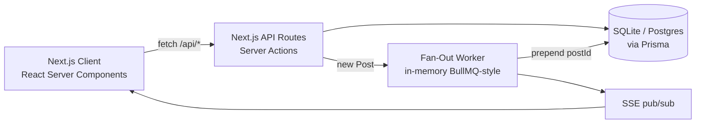

<div align="center">
  

  # STRATA

  **Own the layer beneath.**

  A premium SocialFi platform where real estate investors post tokenized
  property deals, follow each other, and earn DeFi yield.

  
  
  
  
  
</div>

---

## Architecture



**Feed = Fan-Out on Write.** Each user has one `Feed` row holding a
JSON-array of postIds (capped at 500). On `POST /api/posts`, the
worker pages followers in batches of 100 and prepends the new postId
to each follower's feed. Reads are a single indexed lookup.

## Tech stack

- **Next.js 14** App Router · TypeScript strict · Server Components by default
- **Tailwind CSS** with CSS-variable brand tokens · custom dark theme
- **Prisma** + SQLite locally (PostgreSQL-ready — swap the `provider`)
- **Zustand** for wallet / UI state
- **Recharts** for yield sparklines · **Framer Motion** for entrance + modal motion
- **shadcn/ui-style** primitives written by hand (no extra dep cost)

## Getting started

```bash
pnpm install
pnpm exec prisma migrate deploy   # applies prisma/migrations
pnpm db:seed
pnpm dev                           # http://localhost:3000
```

Reset DB: `pnpm db:reset` · Run tests: `pnpm test`

## Auth

Two paths:
- **SIWE (real wallets)** — Sign-In with Ethereum. Nonce → personal_sign →
  signature verified server-side with `viem.verifyMessage` → httpOnly
  session cookie. Auto-provisions a user on first sign-in.
- **Demo switcher** — pick any seeded user from the header dropdown.
  Disable in production with `ALLOW_DEMO_AUTH=0`.

The session is read in every server route via `lib/session.ts`.

## API

| Method   | Endpoint                    | Purpose                                 |
| -------- | --------------------------- | --------------------------------------- |
| `GET`    | `/api/feed`                 | Paginated feed (`?cursor`, `?pageSize`, `?filter`) |
| `POST`   | `/api/posts`                | Create post + enqueue Fan-Out worker    |
| `PUT`    | `/api/follow/:userId`       | Follow user (idempotent)                |
| `DELETE` | `/api/follow/:userId`       | Unfollow                                |
| `GET`    | `/api/users/:username`      | Profile + counts + holdings             |
| `POST`   | `/api/invest/:postId`       | Mock invest (decrements ETH, mints tokens) |
| `GET`    | `/api/portfolio`            | Current user's holdings + activity      |
| `POST`   | `/api/posts/:id/like`       | Toggle like (persists in `Like` table)  |
| `GET`    | `/api/posts/:id`            | Single post with `likedByMe` enrichment |
| `GET`    | `/api/feed/events`          | SSE stream — emits new post IDs to subscribers |
| `POST`   | `/api/upload`               | Multipart image upload (≤ 5 MB)         |
| `GET`    | `/api/auth/nonce`           | SIWE nonce + cookie                     |
| `POST`   | `/api/auth/verify`          | SIWE signature verify + set session     |
| `POST`   | `/api/auth/demo`            | Demo sign-in by username                |
| `POST`   | `/api/auth/logout`          | Clear session cookie                    |
| `GET`    | `/api/auth/me`              | Current session user                    |

## Project shape

```
app/
  layout.tsx              Brand-locked shell · sticky header · JSON-LD
  page.tsx                Feed (RSC) → <FeedList> (client, infinite scroll)
  explore/page.tsx        All LISTING posts
  portfolio/page.tsx      Holdings table + activity
  profile/[username]/     Hero + stats + holdings + activity
  api/                    REST endpoints (all `force-dynamic`)
components/
  PostCard.tsx            Compound component: .Header .Body .PropertyBadge .Chart .Actions
  Sidebar.tsx             Nav · wallet card · "New Post" CTA
  RightPanel.tsx          Market pulse · suggestions · trending properties
  Composer.tsx            3-step modal (type → form → preview)
  WalletPanel.tsx         Slide-in drawer with txn history
  Logo.tsx                SVG mark — 4 stacked slabs, hover-staggered animation
lib/
  fanout.ts               In-memory queue + SSE pub/sub
  prisma.ts               Global PrismaClient
  stores.ts               Zustand: wallet, UI
  format.ts               ETH/USD formatters
prisma/
  schema.prisma           User · Post · Follow · Feed · Investment · Holding
  seed.ts                 5 users · 15 posts · 11 follows · 15 investments
```

## Design

- **Background** `#070B14` with a fixed SVG-noise overlay + radial brand glows
- **Brand gradient** `#6366F1 → #A855F7 → #EC4899` — used on CTAs, logo, accents
- **Gold** `#D4AF37` for tokenized-property motifs
- **Mint** `#00FFB3` for yield / on-chain success
- **Card surfaces** `#0E1422` / `#141B2D` · borders `#1E2A42`
- Animated gradient avatar rings on profile pages
- Staggered entrance fade-up on every PostCard (Framer Motion)
- Logo layers shift up 2px on hover, staggered by 40ms

## Production notes

This is a portfolio reference, but the path to production is concrete:

- **Database**: swap `provider = "sqlite"` → `"postgresql"` in `prisma/schema.prisma`,
  set `DATABASE_URL` to a Neon/Supabase Postgres URL, run `prisma migrate deploy`.
- **Fan-Out queue**: `lib/fanout.ts` is in-memory and resets per cold start.
  For real deploys use Redis + BullMQ (or Upstash QStash / Vercel Queues) with
  a separate worker process. The job shape (`{ postId, creatorId }`) and the
  prepend-with-dedup-and-cap algorithm don't change.
- **SSE**: `/api/feed/events` works on Node runtime but Vercel serverless
  cuts streams at 30s. Either run on a node-server target or move to
  WebSockets / Ably / Pusher for multi-instance deploys.
- **Image storage**: `POST /api/upload` writes to `public/uploads/` — fine
  for local. Swap for Vercel Blob / S3 in production (≤ 10 LoC change).
- **Env vars**: `DATABASE_URL`, `ALLOW_DEMO_AUTH=0` to disable demo sign-in.
- **CSP**: add a `Content-Security-Policy` header restricting img sources to
  Unsplash / pravatar / your uploads CDN.

## Roadmap

- Real chain integration (SIWE auth · wagmi · viem · WalletConnect)
- Chainlink price feeds for live ETH/USD and yield oracle
- ERC-1400 / RealT-style property token standard with on-chain dividends
- Governance token (`$STRT`) with weighted voting on platform listings
- Native mobile (Expo) sharing the same feed Fan-Out API
- Background SSE feed updates → real-time PostCard insertion

---

<sub>Built as a portfolio-grade reference for SocialFi UX. © STRATA.</sub>
